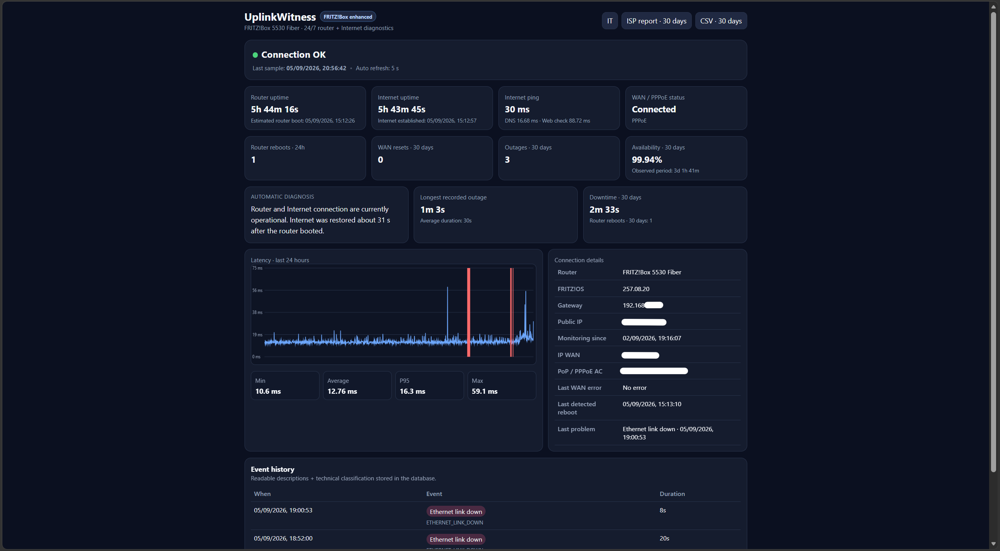
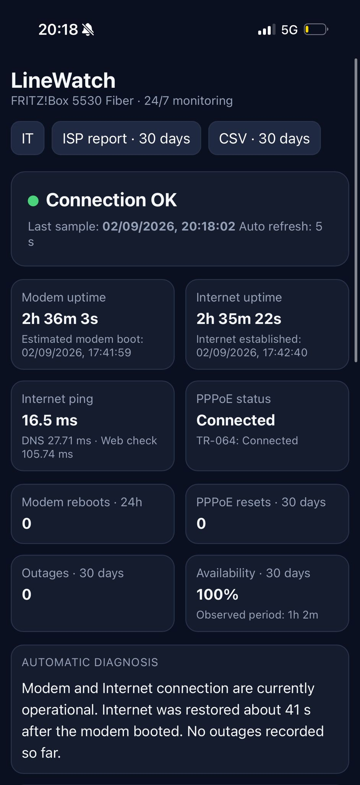

# LineWatch

[](https://github.com/LucaXTech/LineWatch/actions/workflows/ci.yml)


**Self-hosted Internet connection monitor for Raspberry Pi and FRITZ!Box routers.**

LineWatch turns a Raspberry Pi into a 24/7 **Internet connection monitor**, **network outage monitor** and small diagnostic black box. It continuously checks router reachability, Internet connectivity, latency, DNS and HTTP availability, while reading FRITZ!Box telemetry over TR-064 to distinguish a **router reboot** from a **WAN/PPPoE reset** or a generic ISP outage.

It is useful when you need objective evidence for intermittent Internet problems: random modem reboots, short disconnections, unstable PPPoE sessions, latency spikes, DNS failures or recurring ISP outages that are difficult to reproduce while support is looking at the line.

The project was developed and validated on a **FRITZ!Box 5530 Fiber running FRITZ!OS 8.20**, but the core TR-064 services used by LineWatch (`DeviceInfo` and `WANPPPConnection` / `WANIPConnection`) are common across many FRITZ!Box models.

## Screenshots

### Desktop dashboard



### Mobile dashboard

<p align="center">
  
</p>

## Typical use cases

- monitor an Internet connection 24/7 from a Raspberry Pi
- detect modem/router reboots automatically
- record Internet outages and total downtime
- monitor PPPoE disconnects and WAN-session resets
- measure home-network and ISP latency over time
- collect evidence before opening an ISP support ticket
- keep a self-hosted connection uptime monitor on the local network
- remotely check connection health through a private VPN such as Tailscale

### Italiano

LineWatch serve per **monitorare la connessione Internet 24/7 con Raspberry Pi**, rilevare **riavvii del modem**, **disconnessioni Internet**, reset **PPPoE**, problemi DNS/HTTP, latenza e downtime. Con FRITZ!Box usa TR-064 per capire se è realmente ripartito il router oppure se è caduta soltanto la sessione Internet.

## What it detects

- FRITZ!Box reboot via router uptime reset
- WAN / PPPoE session reset without router reboot
- router unreachable
- physical Ethernet link down
- Internet unreachable while the router is reachable
- DNS failure
- HTTP connectivity failure
- WAN IP changes
- latency trends and packet-level reachability

It also stores FRITZ!Box event logs around incidents when available.

## Dashboard

The responsive local dashboard provides:

- current connection status
- router and WAN uptime
- estimated router boot time
- current latency plus 24 h min / average / P95 / max
- reboot, WAN reset and outage counters
- observed-period availability
- downtime and outage duration statistics
- event timeline
- Italian / English UI
- CSV export
- human-readable ISP diagnostic report

The availability percentage is calculated only over the time LineWatch has actually been monitoring, rather than pretending that a new installation already has 30 days of observations.

## Compatibility

### Full functionality

LineWatch is intended for **FRITZ!Box routers with TR-064 enabled** and an account allowed to access FRITZ!Box settings.

Tested:

- FRITZ!Box 5530 Fiber
- FRITZ!OS 8.20
- Raspberry Pi 3
- Raspberry Pi OS Lite 64-bit

Other FRITZ!Box models should work when they expose the standard `DeviceInfo` service and an active `WANPPPConnection` or `WANIPConnection` service.

### Other modem/router brands

The network probes themselves are generic, but the current release is **not a universal modem monitor**. Reboot detection, WAN-session telemetry and router event logs depend on FRITZ!Box TR-064. Supporting other vendors would require vendor-specific adapters.

## FRITZ!Box setup

In the FRITZ!Box interface:

1. Enable local application access / TR-064 under the local-network settings.
2. Use a FRITZ!Box user with permission to access FRITZ!Box settings.

**You do not need to create a new user specifically for LineWatch.** An existing account works. A dedicated account is optional if you prefer separate credentials for the monitor.

Remote/Internet access for that FRITZ!Box account is not required.

## Quick install

Recommended: Raspberry Pi OS Lite, connected to the FRITZ!Box by **Ethernet**.

```bash
git clone https://github.com/LucaXTech/LineWatch.git
cd LineWatch
chmod +x install.sh
./install.sh
```

The installer asks for the existing FRITZ!Box username and password, creates a private `.env`, installs the Python environment and registers both systemd services.

Then open:

```text
http://linewatch.local:8080
```

If mDNS is unavailable, use the Raspberry Pi's LAN IP with port `8080`.

## Manual configuration

Copy:

```bash
cp .env.example .env
chmod 600 .env
```

At minimum set:

```text
FRITZ_USER=your-user
FRITZ_PASSWORD=your-password
```

`FRITZ_HOST` may be left empty: LineWatch uses the default IPv4 gateway automatically.

## Services

```bash
systemctl status linewatch
systemctl status linewatch-dashboard
```

Live monitor log:

```bash
journalctl -u linewatch -f
```

## Remote access

The dashboard deliberately has no public-Internet authentication layer. Do **not** expose port 8080 with router port forwarding.

For private remote access, a mesh VPN such as Tailscale is a good fit:

```bash
curl -fsSL https://tailscale.com/install.sh | sh
sudo tailscale up
tailscale ip -4
```

Then open `http://<tailscale-ip>:8080` from another device in the same tailnet.

## Data and privacy

Runtime data stays on the Raspberry Pi:

- `data/linewatch.sqlite3` — SQLite database
- `data/events/` — incident bundles and FRITZ!Box logs

The repository ignores `.env`, runtime databases and logs. Do not commit real router credentials, event logs, WAN/public IP addresses or personal network data.

## Architecture

```text
FRITZ!Box
   │
   ├── Ethernet carrier / gateway ping
   ├── TR-064: uptime, WAN state, WAN IP, device log
   │
Raspberry Pi ── Internet probes
   │             ├── ICMP
   │             ├── DNS
   │             └── HTTP connectivity
   │
   ├── SQLite event store
   └── Web dashboard :8080
```

## Notes

Some FRITZ!Box models expose additional vendor-specific TR-064 services. For example, the tested 5530 Fiber exposes `X_AVM-DE_WANFiber`, but on the tested firmware its optical values were not populated. LineWatch therefore does not rely on those values for incident classification.

## Status

Early public release. The monitor is already useful for long-running home/ISP diagnostics, but more FRITZ!Box models should be validated before claiming universal FRITZ!Box compatibility.
